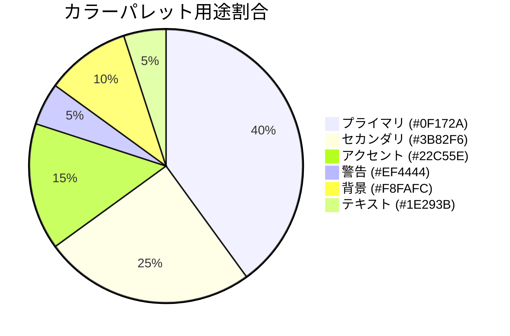
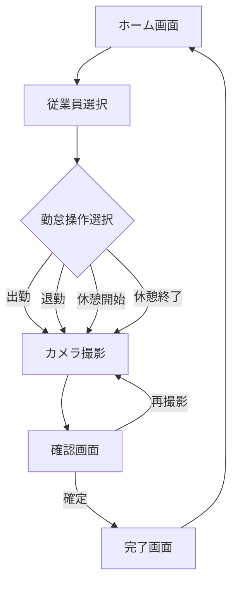
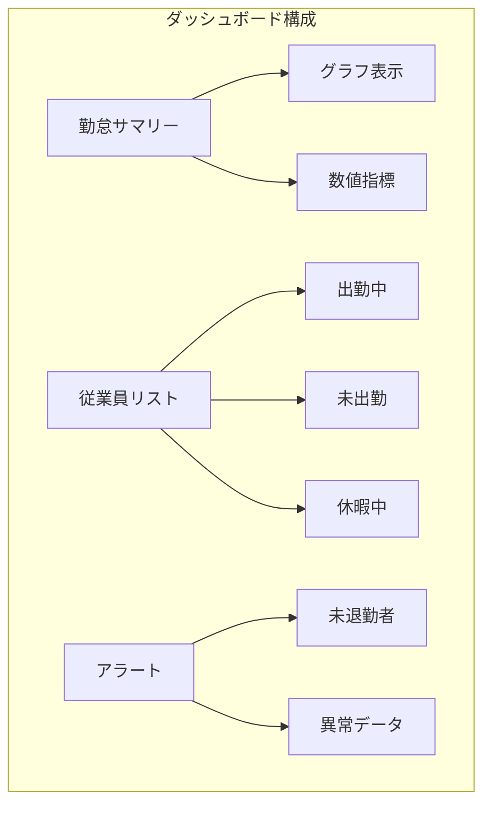

# 勤怠管理システム - デザインレイアウト

## 1. デザインシステム

### カラーパレットとブランディング

本システムは、信頼性と使いやすさを表現するカラーパレットを採用しています。メインカラーには濃紺（#0F172A）を使用し、専門性と信頼感を演出します。アクセントとして青（#3B82F6）と緑（#22C55E）を配置することで、清潔感とアクションの明瞭さを強調します。警告表示には赤（#EF4444）を限定的に使用し、ユーザーの注意を適切に喚起します。

背景には薄いグレー（#F8FAFC）を採用し、長時間の使用でも目の疲れを軽減します。テキストには濃いグレー（#1E293B）を使用することで、読みやすさを確保しています。

以下に主要なカラースキームを示します：

### タイポグラフィ設計

フォントには、日本語の可読性に優れたNoto Sans JPを採用しています。デバイスの多様性を考慮し、フォントサイズはレスポンシブに対応します。ヘッドラインには太字（Bold）24px、サブヘッドラインには20px、本文には16pxを基本サイズとして使用し、階層的な情報設計を視覚的にサポートします。

### 主要コンポーネント設計

本システムでは、操作性を重視した大型のUIコンポーネントを採用しています。特に勤怠記録用の各ボタン（出勤・退勤・休憩）は、タップミスを防ぐため十分な大きさで設計され、色分けされています。また、写真撮影を行うカメラコンポーネントは、使用者が自分の顔を明確に確認できるよう大きなプレビュー表示を特徴としています。

主要コンポーネントの特徴は以下の通りです：

| コンポーネント | スタイル特徴 | 使用場面 |
|-------------|------------|--------|
| アクションボタン | 大型（高さ60px以上）、鮮明な色分け | 出勤・退勤・休憩操作時 |
| カメラプレビュー | 端末画面の70%以上を占める大型表示 | 写真撮影時 |
| 情報カード | 角丸、影付き、パディング十分 | 勤怠情報表示時 |
| データテーブル | ゼブラストライプ、コンパクトな行高 | 履歴一覧表示時 |
| モーダルダイアログ | センター表示、半透明オーバーレイ | 確認・エラー表示時 |

## 2. 画面構成と遷移フロー

本システムは2つの主要画面（勤怠記録用と管理用）で構成されており、それぞれが明確に分離されたデザインとなっています。各画面の遷移は、ユーザーの行動パターンを考慮して設計されており、最小限のステップで目的の操作が完了できるよう最適化されています。

レスポンシブ対応として、勤怠記録用画面はタブレットサイズ（768px〜1024px）に最適化し、管理用画面はデスクトップ（1280px以上）での使用を想定しています。これにより、それぞれの利用シーンに最適な操作性を提供します。

## 3. 勤怠記録用画面のデザイン

### メイン画面の構成

勤怠記録用のメイン画面は、「分かりやすさ」と「操作の確実性」を最重視した設計です。画面上部には大きなデジタル時計と日付表示を配置し、ユーザーがいつでも現在時刻を確認できるようにしています。

中央部には従業員選択エリアを設け、写真付きのリスト形式で表示することで、視覚的に素早く自分を識別できる設計となっています。画面下部には大型の操作ボタンを配置し、出勤・退勤・休憩開始・休憩終了といった主要な勤怠アクションを一目で判別できるよう色分けされています。

また、当日の勤怠記録をサイドパネルとして表示し、既に記録された情報をすぐに確認できる機能も実装しています。

### カメラ撮影画面の設計

カメラ撮影画面は、シンプルかつ直感的な操作性を提供します。画面の大部分をカメラプレビューが占め、ユーザーが自分の顔をはっきりと確認できるよう設計されています。撮影ボタンは画面下部中央に大きく配置し、操作ミスを防ぎます。

撮影後は、撮影した写真を確認できる画面に自動遷移し、問題なければ確定ボタン、やり直したい場合は再撮影ボタンを選択できます。この二段階の確認プロセスにより、撮影ミスによる勤怠記録エラーを防止します。

### 完了確認画面の工夫

勤怠記録完了後の確認画面では、「記録完了」というメッセージと共に、タイムスタンプと撮影写真のサムネイルを表示します。この画面は3秒後に自動的にメイン画面に戻る設計ですが、ユーザーがすぐに次の操作に移りたい場合は「OK」ボタンでスキップすることも可能です。

## 4. 管理用画面のデザイン特性

管理用画面は、データの可視性と操作性を重視した設計となっています。情報密度が高いため、デスクトップ環境での使用を前提としていますが、タブレットでも基本機能が利用できるレスポンシブ設計を採用しています。

### ダッシュボードの視覚化

管理者のダッシュボードでは、当日の勤怠状況を一目で把握できるよう、グラフとカードUI要素を組み合わせた表示を採用しています。特に、現在出勤中の従業員リストは写真付きで表示され、視覚的な確認が容易になっています。

未退勤者や異常データがある場合は、アラート表示で注意を促し、問題点へすぐにアクセスできるクイックアクションリンクを提供しています。

### データ表示と操作性

勤怠履歴一覧画面では、フィルター機能を充実させ、日付範囲や従業員名、部署などで絞り込むことができます。データテーブルは一度に適切な量の情報を表示するよう設計され、ページネーションで大量データも快適に閲覧できます。

各行には写真サムネイルと基本情報を表示し、詳細ボタンをクリックすることで個別の勤怠記録詳細画面に遷移する設計です。また、データのエクスポート機能もシンプルなボタン操作で実行できます。

### レポート画面の視覚化

レポート画面では、データの視覚化を重視し、グラフと表を効果的に組み合わせた表示を採用しています。日付範囲選択や従業員/部署選択などのフィルター操作は画面上部にまとめ、結果の表示領域を広く取ることで情報の閲覧性を高めています。

生成されたレポートはPDF形式でエクスポートできる機能を備え、会議資料や報告書として活用できるよう設計されています。

## 5. 共通UI要素と使用体験の統一

### 写真表示の一貫性

システム全体で、撮影された写真の表示方法に一貫性を持たせています。一覧表示では適切なサイズのサムネイルとして表示し、詳細確認時には拡大表示が可能です。写真はモーダルウィンドウで拡大表示され、必要に応じてダウンロードや共有もできるUIを実装しています。

### アニメーションとフィードバック

ユーザー体験を向上させるため、適切なアニメーションを施しています。特にカメラ起動時には滑らかな移行アニメーションを、撮影時にはシャッター効果を採用し、操作の視覚的フィードバックを明確にしています。

ボタン操作時のホバーエフェクトや、データ送信中のローディング表示なども統一感のあるデザインで実装し、システム全体の使用感の一貫性を担保しています。

### エラー表示と確認メッセージ

予期せぬエラーやユーザー操作の確認が必要な場合、一貫したスタイルのダイアログを表示します。エラーメッセージは赤色ベースで注意を喚起し、確認メッセージは青色ベースで穏やかに表示します。

特にカメラアクセスのエラーなど、システム機能に関わる重要なエラーは、問題解決のためのガイダンスも同時に表示するよう設計されています。 